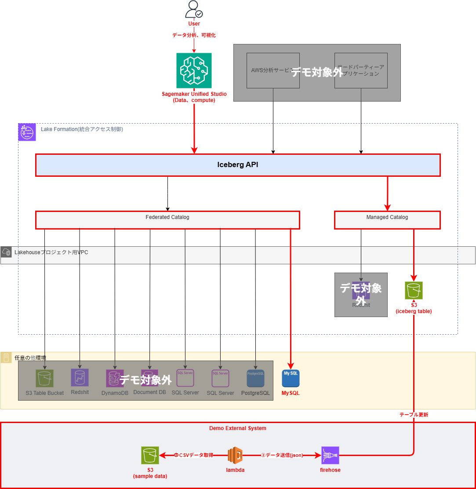

# 目次

- [目次](#目次)
- [目的](#目的)
- [構成](#構成)
- [開発環境設定](#開発環境設定)
  - [pythonをインストール](#pythonをインストール)
  - [aws cliをインストール](#aws-cliをインストール)
  - [node.jsをインストール(Gemini CLIはnode.jsが必要)](#nodejsをインストールgemini-cliはnodejsが必要)
  - [dockerをインストール(Gemini Sandboxで必要)](#dockerをインストールgemini-sandboxで必要)
  - [Gemini CLIをインストール](#gemini-cliをインストール)
  - [~~AWS CDKをインストール~~](#aws-cdkをインストール)
  - [Terraformをインストール(tfenv)](#terraformをインストールtfenv)
  - [AWS SAM CLIをインストール](#aws-sam-cliをインストール)
  - [お勧めのVS Code拡張機能](#お勧めのvs-code拡張機能)

# 目的

まず、SageMaker Lakehouseの概念検証及びデモするための環境を構築する

# 構成

まず、SageMaker Lakehouseの一般的な概念図

今回デモする範囲

# 開発環境設定

## pythonをインストール

https://github.com/pyenv/pyenv

## aws cliをインストール

https://docs.aws.amazon.com/ja_jp/cli/latest/userguide/getting-started-install.html

## node.jsをインストール(Gemini CLIはnode.jsが必要)

https://nodejs.org/en/download

## dockerをインストール(Gemini Sandboxで必要)

https://docs.docker.com/engine/install/ubuntu/#install-using-the-convenience-script

## Gemini CLIをインストール

https://github.com/google-gemini/gemini-cli

## ~~AWS CDKをインストール~~

https://docs.aws.amazon.com/ja_jp/cdk/v2/guide/getting-started.html

## Terraformをインストール(tfenv)

https://github.com/tfutils/tfenv

## AWS SAM CLIをインストール

https://docs.aws.amazon.com/serverless-application-model/latest/developerguide/install-sam-cli.html

## お勧めのVS Code拡張機能

必須
- Python
- Python Debugger
- AWS Toolkit (AWS SAM CLIでローカルでデバッグ用)

便利ツール
- Pylance/Black Formatter(好きな片方でよい)
- Markdown All in one
- Git Graph
- Gemini Code Asist
